# Discrete Summary Statistics
Mode: most often category

Quantiles: category occurring > *t* times

- Mean and std are sensitive to extreme values/outliers

# Supervised Learning
with discrete labels, SL is classification

- Take features of objects & corresponding labels as inputs
- Output a program that can predict the labels of a new object

## Decision Trees

Decision Stump: accuracy score

Pseudo-code

```
Input: feature matrix X & label vector y
for each feature j
	for each example i
		set threshold to feature j in example i
		find mode of y when j > threshold
		find mode y when j <= threshold
		classify all examples based on t
		count # of errors
		store this rule if error is the lowest so far
Output: a decision stump rule
```
* Sort rules, update scores O(ndlogn)

## Greedy Recursive Splitting
Find the decision stump with the best score, split into 2 small datasets, find a decision stump to each dataset.

## IID (Independent and Identically Distributed) Assumption
All objects: same distribution, sampled independently

## Optimization Error
when not many models to choose, optimization error is small when lots of models big

## Parametric vs. Non-parametric
Parametric models:

- Fixed number of parameters
- Estimate more accurately with more data

Non-parametric models:

- Number of params grows with *n*
- Model gets more complicated with more data

## KNN (K Nearest Neighbours)

*Non-parametric*

Assumption: objects with similar feature likely have similar labels.

Algorithm:

- Find *k* training examples xi that are most similar to x
- Classify using the mode of their yi.

Notes:

- No training phase, expensive prediction
- Problematic if features have different scales

# Ensemble Methods
Classifiers that have classifiers as input

## Boosting (AdaBoost)
Take simple classifier that underfits, improve training error

- Fit a classifier on the training data —> give a higher weight to examples that the classifier got wrong —> Fit a classifier on the weighted data —> Recurse

Prediction: weighted vote of individual classifier prediction

## Averaging
Take complex classifiers that overfit, improve test error

Input: the predictions of a set of models

- Take the mode of the predictions (or average)

Stacking: fit another classifier that uses the predictions as features

## Random Forests
Average a set of deep decision trees

Fast prediction

- Bootstrap Aggregation/Bagging:

  *Random sampling examples*

  - Generate several bootstrap examples (63% of original objects)
  - Fit a classifier to each bootstrap sample
  - At test time, average predictions

- Random Trees

  When tilting each decision stump to construct deep decision tree:

  - Do not consider all features
  - Each split only consider a small number of randomly-chosen features

# Unsupervised Learning
Only have X, no explicit target labels

Uses:

- outlier detection
- data visualization
- association rules (xi and xj occur together)
- latent-factors (which parts are xi made from)
- ranking
- clustering

## Clustering
Input: set of objects described by features xi

Output: an assignment of objects to 'groups'

## K-means
*vector quantization*

Input: K, initial guesses of means/centers

Algorithm: assign xi to closest, update means, repeat until no object change groups

- Guaranteed to converge with Euclidean distance
- New object assigned to nearest mean
- Bootstrapping, random initial means and choose best/combine
- label switching: is xi in the came cluster as xj?

## DBSCAM (Density-Based Clustering)

*Non-parametric*:

- Clusters more complicated with more data
- No fixed *k*

Hyperparams: radius, minPts

- radius: max distance between points to be considered close or reachable
- minPts: # of reachable points
- core point: point with ≥ minPts meighbours with distance ≤ radius

Pseudo-code:

```
for each xi:
	if xi is already in a cluster do nothing
	Test if xi is a core point
	--> yes: expand cluster
	--> no: do nothing

Expand fn:
	Assign all xj within distance 'r' of core point xi to cluster
	for each newly-assigned neighbour that is a core point, expand cluster
```

- Sensitive to choices of hyperparams
- For new examples, finding cluster is expensive (compute distances to training points)

## Density-Based Hierarchical Clustering
Fix minPoints, record clusters as you vary the radius

### Agglomerative (Bottom-up Clustering)
Start with each point in its own cluster, each step merges 2 closest clusters, stop when everything is one big cluster

Closest clusters:

- Average link: average distance between points in clusters
- Single-link: min distance between points in clusters
- Complete-link: max distance between points in clusters
- Ward's method: minimize within cluster variance

It's possible to use supervised learning for clustering — Image segmentation.

## Outlier Detection

*unsupervised*

### 1 Model Based Outlier Detection

Fit a probabilistic model, outliers are examples with low probability

sensitive to outliers example: Z-score

### 2 Graphical Outlier Detection
Look at plots of data and human decides

Examples:

- Box plot (only 1 variable)
- Scatterplot (detect complex patterns, only 2 variables)
- Scatterplot array (all combination of variables, only 2 variables at a time)
- Scatterplot of 2-dimensional PCA (see high-dimensional structure, PCA sensitive to outliers, might be info in higher PCs

### 3 Cluster-Based Outlier Detection
Cluster data, find points which don't belong to clusters

Examples:

- K-Means (find points far from an mean, find clusters with a small number of pints)
- DBSCAN (outliers: points not assigned to any cluster)
- Hierarchical DBSCAM (outliers take longer to join other groups, good for outlier groups)

### 4 Distance-Based Outlier Detection
Directly measure how close objects are to their neighbours

Global Distance-Based Outlier Detection — KNN Outlier Detection:

For each point, compute the average distance to its KNN, sort these values choose the biggest values as outliers

### 5 Supervised outlier Detection
Use supervised learning: yi = 0 if xi is a regular pint, yi=1 if xi is an outlier

Needs supervision: what outliers look like, may not detect new types of outliers

# Linear Regression

*supervised*

Classification (discrete yi) —> Regression (mumerical yi)

## Linear Regression based on squared error

### Linear Regression in 1D (1 feature)
yi = wXi (w: weights/regression coefficient of Xi — Linear Model

Make predictions: y_hat = wXi_hat

Sum of squared errors:

$f(w) = \sum_{i=1}^{n}{(wX_i-y_i)^2}$

Minimizers: All *w* where ∇f(w)=0

### Notation
​                  |w1 |				  |y1 |				   | xi1 |				  |—— x1^T —— |

w (d x 1) =|w2 |  		y (n x 1) = |y2 |		xi (d x 1) = | xi2 |		X (n x d) = |—— x2^T —— |

​                  |wd |                   	   |yn|				   | xid |				   |—— xn^T —— |

### Least squares in D-Dimensions

yi = w^Txi  	f(w) = (1/2) sum (i=1 to n) (w^Txi - yi)^2 = (1/2) sum (i=1 to n) ri^2 = (1/2) ||Xw - y||^2

∇w[c] = 0, ∇w[w^Tb] = b, ∇w[(1/2)w^TAw] = Aw for symmetric A

∇f(w) = X^TXw - X^Ty

```python
w = solve(X.T@X, X.T@Y)
yhat = X@w
```

### Least Square Issues

- solution may not be unique
- sensitive to outliers
- always uses all features
- data can be big that X^TX can't be stored
- may predict outside of range yi values
- assume linear relationship

### Model y intercept

Add a column of 1's to X (new matrix Z)

# Norms of Vectors

L0: # of non-zero values

L1: ||r||_1 = sum (i=1 to d) |rj|

L2: ||r ||_2 = ||r|| = sqrt(sum (i=1 to d) ri^2)

L∞: max {|ri|}

# Collinearity
Two features identical for all examples. Collinear solution is not unique.

# Convex Function
*eg. e^x, X^2*

**Key:** a local minimum is also a global minimum

# Optimization
Objective function: the thing being maximized/ minimized

Dimensionalities: input can be non-scalar-values, the function should be scalar-valued

# Robust Regression/Huber Loss
Least absolute error f(w) = ||Xw - y||_1

## Gradient Descent
An iterative optimization (minimization) algorithm: finds local minima of differentiable function

## 'Brittle' Regression
Care about outliers (for example, want the best performance on worst training example): use infinity norm

## Log-Sum-Exp Function
As with L1-norm, L∞ norm is convex but non-smooth.

Log-Sum-exp function is a smooth approximation to the max function

max(z_i) = log( \sum{exp(z_i)} )

Intuition: largest element is magnified exponentially while smaller elements become negligible

# Nonlinear Regression

## Adapting Counting/Distance-Based Methods

Adapt our classification methods to perform regression

## Linear Least Squares for Quadratic Models

Change of basis:

yi = w0 + w1xi + w2xi^2 + … (w0 will be the y-intercept)

Z = [1's | xi | xi^2]

Linear functin of w, quadrtic function of xi.

Prediction: y=Zw

To select degree polynomial: validation and cross-validation

### Parametric vs Non-parametric Bases

yi = w0 + w1 f1(xi) + w2 f2(xi) + … 

Wrong basis: more data doesn't help

## Radical Basis Functions (RBFs)

*Non-parametric* bases that can model any function

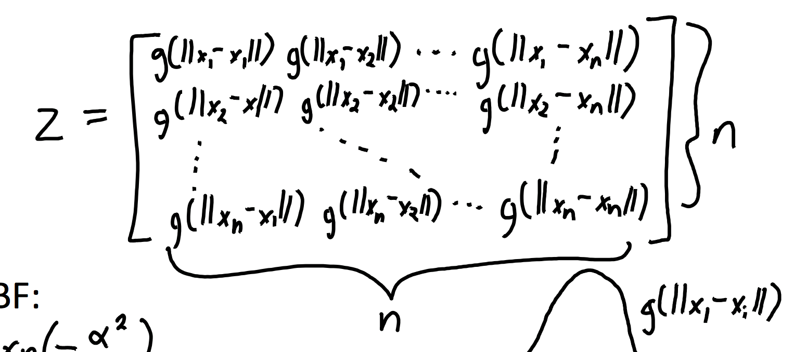


Guassian  RBF:

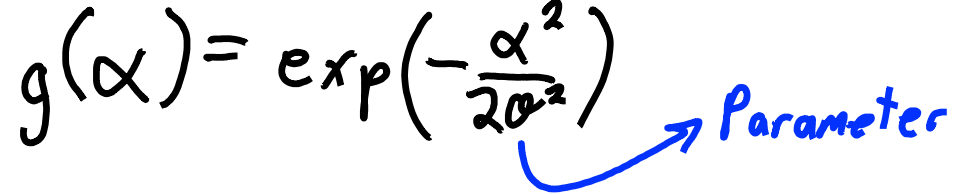

Variance sigma^2 controls influence of nearby points

Gaussian RBFs are universal approximators

- Can approximate any continuous function to arbitrary precision.
- Achieve irreducible error as *n* goes to infinity.

# Feature Selection

Challenges:

- Conditional independence and variable dependence
- Tiny effects and context-specific relevance
- Causality and confounding (hidden effects making irrelevant relevant) —> won't resolve

# L0 Regularization

*non-smooth, does feature selection, encourages exactly zeros in w*

f(w) = (1/2)||Xw-y||^2 + lambda||w||_0

Larger lambda, emphasize feature selection

# L2 Regularization/Ridge Regression

*convex, doesn't do feature selection, tend to be non-zeros in w, solution unique*

f(w) = (1/2)||Xw-y||^2 + (lambda/2)||w||^2

Traning error decreases, but reduces overfitting

Gradient: ∇f(w) = X^TXw - X^Ty + lambda w

Linear system: (X^TX - lambda I) = X^Ty

# L1 Regularization

*feature selection, requires iterative solver, solution not unique*

f(w) = (1/2)||Xw-y||^2 + (lambda/2)||w||_1

# Linear Classifiers

Training: linear regression model

Prediction: take the sign yi=sign(w^Txi)

What we want is the 0-1 loss (# of classification errors)

Convex approximations: Hinge loss, support vector machine — define y in {+1, -1}

## Hinge Loss

f(w)=sum(i=1 to n) max{0, 1-yiw^Txi}

## Support Vector Machine (SVM)

Hinge Loss with L2 regularization — Maximum-Margin Classifier (choose the farthest from both classes)

f(w)=sum(i=1 to n) max{0, 1-yiw^Txi} + (lambda/2)||w||^2

# Logistic Regression

*convex, differentiable, minimizes with gradient descent*

Minimizes logistic loss: 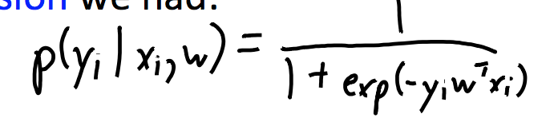 f(w) = sum(i=1 to n) log(1+ exp(-yiw^Txi))

# Multi-Class Classification

X (n by d), Y (n by k) W=[w1 | w2 … | wk] (d by k)

To predict, pick *c* with the largest value of w_c^Txi, where c=index of largest yi

## Softmax Loss Function

*non-smooth, natural generalization of logistic regression*

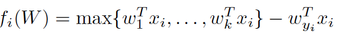

log-sum-exp (w_yi are the weights for the true label)

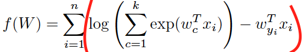

## Local vs Global Features

Global: feature a when b=0, feature a when b=1

Local features make prediction personalized:

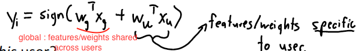

# Kernel Methods

w = Z^T(ZZ^T+lambda I)^(-1)y

Gram matrix 'K'

K = ZZ^T (n by n)

'k' must be an inner product

## Kernel Trick with Polynomials

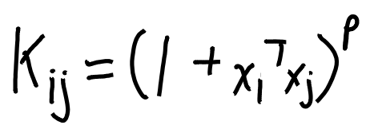

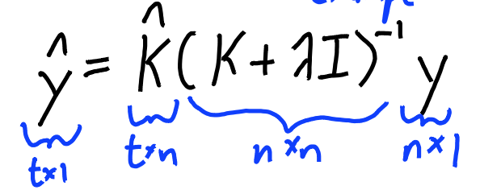

## Gaussian-RBF Kernel
*infinite-dimensional, prone to overfitting, non-parametric*

infinitely many features in finite computational Ume

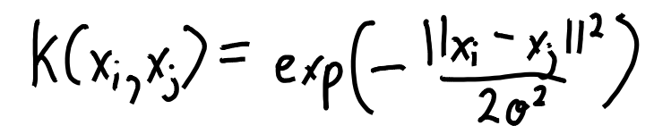

# Generative vs. Discriminative Models

Generative models use Bayes rule and models p($x_i | y_i$) to predict p($y_i | x_i$)

Discriminative models directly model p($y_i | x_i$) to predict p($y_i | x_i$)

# Maximum Likelihood

P(w|X, y) = P(y|X, w) P(w)   P(y|X, w) is likelihood, P(w) is prior

Choice of likelihood —> choice of loss function, choice of prior —> regularization

## Maximum Likelihood Estimation

Minimize 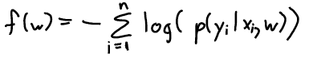

Guassian Likelihood: minimize f(w) = (1/2)||Xw-y||^2

## Maximizing a Posteriori

Guassian Prior: 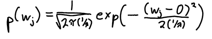

Negative log-prior: (lambda/2)||w||^2

# Probabilistic Classifiers

model the conditional probability, p(yi | xi)

## Naive Bayes

assume features are independent given label

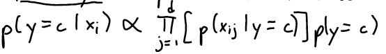

# Principal Component Analysis (PCA)
*parametric linear model, insensitive to initialization*

W is k by d; each row is a mean; each column is a feature

Objective funtion (*non-convex, solution non-unique*):

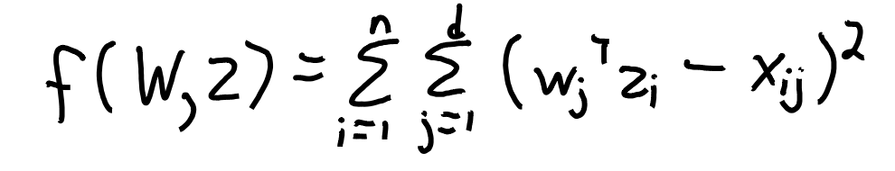

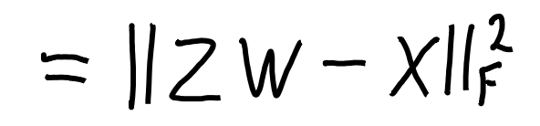

Latent-factor model:

- w_c (row of w) called “factors” or “principal components”
- z_i (z_i^T is row of Z) are called “factor loadings” or “low-dimensional basis”
- linear combination of all means/factors
- soft assignments to the cluster means

matrix factorization model:

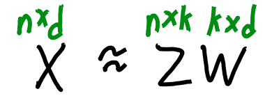

learning the latent factors ‘W’ and latent features zi

Dimensionality reduction: replace ‘X’ with lower-dimensional ‘Z’

try to reconstruct the original points (X) using only the ‘k’ basis vectors

Much better approximation than vector quantization.

## PCA Applications

- Dimensionality reduction
- Outlier detection
- Partial least squares
- Data visualization (use PCA to get the location of the zi values, plot zi)
- Data interpretation

## PCA Issues

k = 1, scaling problem. k > 1, have scaling, orthogonality, rotation, label switching.

## Choosing number of latent factors (k)

Variance explained: span of points on line 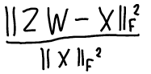

## SVD

PCA uses SVD which gives orthogonal PCs ordered by importance.

Orthogonal basis and sequential fitting of PCs leads to non-redundant PCs with unique directions.

## Non-negative matrix factorization (NMF)
*non-convex, sensitive to initialization*

Builds on PCA, adds requirement of non-negativity

Makes object out of parts

Non-negativity tends to generate sparse solutions

projected gradient algorithm

```
run gradient descent iteration
after each step, set negative values to 0
repeat
```

## Robust PCA

Absolute error, robust to outliers (increases slower)

# Manifold Learning

focuses on low-dimensional curved structures

## Multi-Dimensional Scaling (MDS)

*non-parametric dimensionality reduction and visualization, non-convex, sensitive to initialization, cannot use SVD*

Directly optimize the final locations of the zi values while preserve high-dimensional “distances” between xi: 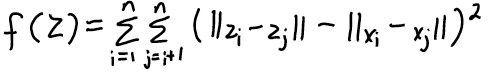

MDS with different distances/losses/weights usually gives better results.

## ISOMAP

latent-factor model for visualizing data on manifolds

## t-SNE

special case of MDS, focus on small distances by allowing large variance in large distances

# Sparsity

Related to feature selection and L1-regularization (w is sparse)

NMF leads to sparse Z and W

# Stochastic Gradient
*iterative optimization algorithm*

used when n is very large

uses gradient of randomly-chosen training example (cost of computing this gradient is independent of n)


**problems:** gradient of random example might point in the wrong direction

control step size (decrease to get convergence)

# Neural Networks
*non-linea, supervisedr*

w is k by 1

W is k by d

## Sigmoid

smooth approximation to binary features

# Runtime Summary


| Models                            | Cost                                     | sensitive to scales |
| --------------------------------- | ---------------------------------------- | ------------------- |
| **Decision Stump**                | O(ndlongn)                               | No                  |
| **Decision Tree**                 | O(mndlogn), m: depth of tree             | No                  |
| **KNN**                           | size of model: O(nd) cost of prediction: O(nd) for 1 test object | Yes                 |
| **K-Means**                       | O(ndk), update means: O(nd)              | Yes                 |
| **DBSCAN**                        | dompute distances O(n^2d)                | Yes                 |
| **RBFs**                          |                                          | Yes                 |
| **Ordinary Least Squares**        |                                          | No                  |
| **Regularized Least Squares**     |                                          | Yes                 |
| **Kernel Trick with Polynomials** | Training: O(n^2d+n^3) Testing: O(ndt)    |                     |
